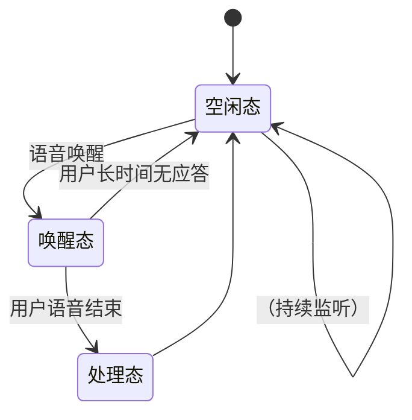

# WinAssistant – Windows 本地语音唤醒与自动化执行

一个在 **Windows** 上运行的本地语音助手：

- 说出唤醒词 → 识别你的语音 → 自动执行自定义动作（脚本、GUI Agent、MCP 等）。
- **全离线**（唤醒+识别均可离线），即插即用，优先使用耳机麦克风。

## 演示视频

## [](data/演示.mp4)

## ✨ 核心特性

- **多唤醒词可选 / 可自定义**
  内置多种常见唤醒词，也可替换为你训练的 `.ppn` 文件。
- **本地唤醒：Picovoice Porcupine**
  轻量、低延迟、可靠，离线运行。
- **语音识别：fast-whisper**
  内置**去噪**、**VAD 端点检测**，自动判断“用户是否说完”，可按需调节模型大小（速度/准确度权衡）。
- **自动音频设备选择**
  自动选择可用的输入/输出设备，**优先耳机**。
- **可插拔“处理态”**
  识别到文本后进入你的“处理态”（可自定义），例如：

  - 调用 MCP / 工具调用
  - 触发 GUI Agent
  - 执行脚本、打开应用、查询信息等

---

## 🧠 工作流 / 状态机



> 说明：唤醒后进入实时听写；若检测到**长时间静音**则回退到空闲态。

---

## 📦 目录结构

```text
WINASSISTANT/
├─ model/
│  ├─ 小智.ppn                 # 自定义/内置唤醒词（Porcupine）
│  └─ porcupine_params_zh.pv  # 中文参数
├─ music/                     # 系统提示音
│  ├─ ok.wav
│  ├─ sorry.wav
│  └─ zai.wav
├─ utils/
│  ├─ player.py               # 播放器：播放提示音/反馈
│  ├─ reader.py               # 识别器：fast-whisper + VAD
│  ├─ rouser.py               # 唤醒：Porcupine 推理
│  └─ UIoperator.py           # 处理态模板（可自定义）
├─ .env                       # 环境变量（见下）
├─ main.py                    # 入口：python main.py
└─ requirements.txt           # 依赖
```

---

## 🔧 关键类与方法

**播放器** `utils/player.py`

```python
# 播放提示音
player.play_voice(self, block=True, type="zai")
```

**识别器** `utils/reader.py`

```python
def realtime_zh(self, rec_shared=None, beep_guard=0.5):
    """
    唤醒后进入：
    - 复用外部 PvRecorder（如果传入），否则自建
    - 可选吞掉 beep_guard 秒提示音
    - 简易 VAD：检测说话，静音超过 MAX_SILENCE_SECS 结束
    - 用 fast-whisper 识别并返回文本
    """
```

**唤醒检测** `utils/rouser.py`

```python
def process(self, pcm):
    return self.porcupine.process(pcm)
```

---

## 🚀 快速开始

### 1) 环境准备

- Windows 10/11
- Python 3.9+（建议 64-bit）
- 麦克风 & 扬声器/耳机

```bash
git clone https://github.com/wanghai673/WinAssistant
cd WINASSISTANT

# 建议：创建虚拟环境
python -m venv .venv
.\.venv\Scripts\activate

pip install -r requirements.txt
```

### 2) 申请 Picovoice Access Key

前往 [https://picovoice.ai/](https://picovoice.ai/) 免费获取 `ACCESS_KEY`。

### 3) 配置 `.env`

在项目根目录创建或修改 `.env`：

```env
ACCESS_KEY=你的AccessKey
# 唤醒词（可选：小智, hey google, grasshopper, computer, americano,
# bumblebee, hey barista, ok google, pico clock, porcupine,
# picovoice, jarvis, terminator, grapefruit, blueberry, alexa, hey siri）
ROUSE_WORD=小智
```

> 想用自定义唤醒词？把训练好的 `.ppn` 文件放到 `model/` 并在代码/ENV 中指向它即可。

### 4) 运行

```bash
python main.py
```

说出唤醒词（默认 **“小智”**）→ 说出命令 → 听到提示音并执行。

---

## 🧩 自定义“处理态”

识别结果会进入你的“处理态”模块（示例：`utils/UIoperator.py`）。
你可以在这里：

- 串接 **MCP** 工具调用
- 通过 **GUI Agent** 操作桌面
- 执行脚本 / 打开应用 / 系统自动化
- 回放 `music/ok.wav / sorry.wav` 作为反馈

> 建议将业务逻辑与语音管线解耦：保留 `player / reader / rouser` 作为通用能力层，处理态专注于“要做什么”。

---

## ⚙️ 常用调优点

- **VAD/静音阈值**：在 `reader.py` 中调整 `MAX_SILENCE_SECS` 等参数，影响“说完就停”的敏感度。
- **模型大小**：根据机器性能切换 fast-whisper 模型（小模型更快，大模型更准）。
- **提示音屏蔽**：通过 `realtime_zh(..., beep_guard=0.5)` 吞掉前 0.5s 系统“滴”声，避免影响识别。
- **音频设备**：默认自动选择，优先耳机；如需固定设备，可在 `player/reader` 中指定设备索引。

---

## 🔐 隐私与本地化

- 唤醒与识别均可**离线**完成；音频不会上传到云端。
- 仅在你显式配置联网服务时才会产生外部调用。

---

## 🧪 简单示例（伪代码）

```python
from utils.player import Player
from utils.reader import Reader
from utils.rouser import Rouser
# from utils.UIoperator import handle_intent  # 你的处理态

player = Player()
reader = Reader()
rouser = Rouser()  # Porcupine

while True:
    if rouser.heard_wake_word():
        player.play_voice(type="zai")  # “在”
        text = reader.realtime_zh(beep_guard=0.5)
        if text:
            # handle_intent(text)
            player.play_voice(type="ok")
        else:
            player.play_voice(type="sorry")
```

---

## 🧯 故障排查

- **没有反应 / 设备占用**：检查是否有其他应用占用麦克风；尝试在系统声音设置中启用设备。
- **识别慢**：试用更小的 fast-whisper 模型或关闭其他高占用程序。
- **唤醒不灵敏**：更换更清晰的唤醒词模型 `.ppn`，或在安静环境下测试。
- **提示音被识别进去**：增大 `beep_guard`（如 `0.7`）。

---

## 📄 许可证

Apache-2.0 / GPL-3.0

---

## 🙌 致谢

- [Picovoice Porcupine](https://picovoice.ai/)（本地唤醒）
- [fast-whisper](https://github.com/guillaumekln/faster-whisper)（快速 ASR）
